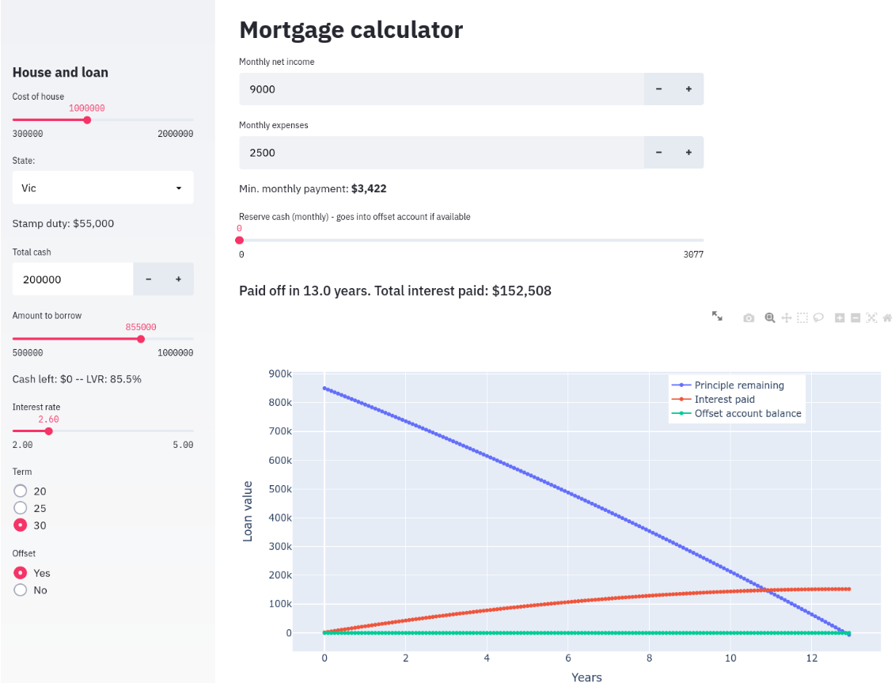

# Mortgage explorer

A Streamlit app to explore an (Australian) loan lifecycle. It helps you figure out what you can afford to borrow and how long it will take to pay off.

The stamp duty calculator is a little simplistic, and does not include first home buyers bonuses, etc. Everything here should be double-checked!

This can be tested using Streamlit share, [here](https://share.streamlit.io/coljac/mortgage-explore/main).

TODO: Accessibility

